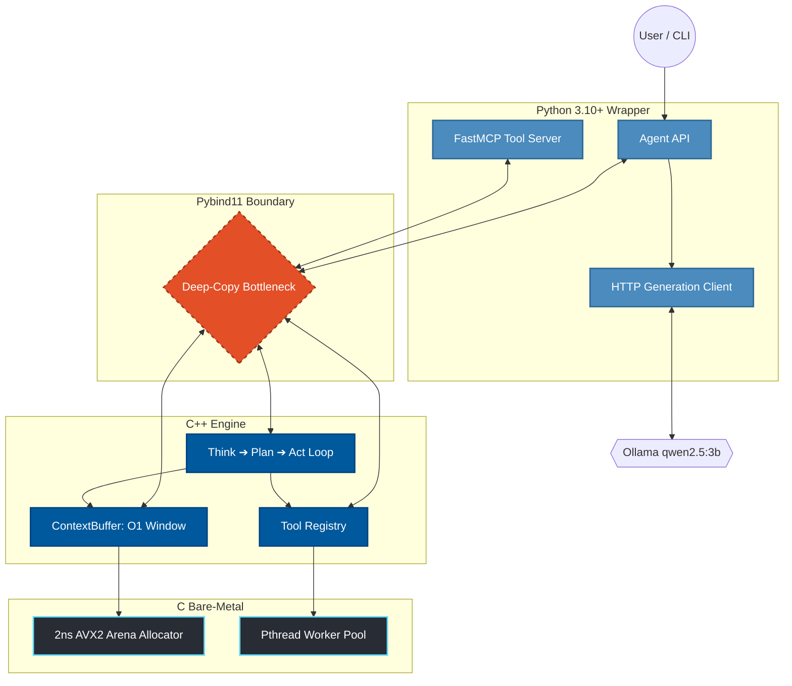

<div align="center">
  <h1>⚙️ IronAgent</h1>
  <p><b>The Bare-Metal AI Agent Orchestrator</b></p>

  <!-- Badges -->
  <a href="https://python.org"></a>
  <a href="https://isocpp.org/"></a>
  <a href="https://en.wikipedia.org/wiki/C11_(C_standard_revision)"></a>
  <a href="LICENSE"></a>
  
  <br />
  <br />
</div>

> [!IMPORTANT]
> **IronAgent** is an experimental, ultra-lightweight AI orchestrator designed to solve the memory bloat and execution overhead of modern agentic frameworks. By pushing the `Think ➔ Plan ➔ Act` state machine down to the native C/C++ layer, it bypasses standard garbage collection in favor of a custom 32-byte aligned memory arena.

<div align="center">
  
</div>

## 💡 Why IronAgent? (The Philosophy)
Modern AI agent frameworks (like LangChain, AutoGen, and CrewAI) are fantastic for prototyping, but they suffer from massive Python and Node.js overhead. When building continuous, long-running agents, memory fragments quickly, and context window pruning (array slicing) becomes an expensive, CPU-blocking operation. 

**IronAgent is a rebellion against AI bloat.** We treat AI orchestration as a high-performance systems engineering problem. By handling memory allocation, thread pooling, and context sliding windows directly in native C and C++, we provide a lightning-fast backend that remains seamlessly controllable via a clean Python API.

## 🎯 Main Applications (Where it Shines)
Because IronAgent prioritizes raw execution speed and low memory footprints, it is uniquely suited for workloads where standard Python frameworks fail:
* 🤖 **Edge AI & IoT Devices:** Running autonomous agents on hardware where RAM is strictly constrained (Raspberry Pi, embedded systems, older laptops).
* 👾 **Game Engines & NPCs:** The custom C arena allocator provides deterministic memory management without garbage collection pauses, making it perfect for integrating LLM agents directly into C++ game loops without stuttering.
* 💻 **Always-On CLI Assistants:** Terminal-native orchestration that idles at ~200MB instead of 1.5GB, letting you run local models (Qwen, Llama) continuously in the background without crippling your machine's resources.
* 🔒 **High-Security / Privacy-First Workflows:** A sandboxed, locally-hosted execution environment for sensitive filesystem and shell manipulation using FastMCP, completely isolated from cloud APIs.

## ✨ Key Features
* 🚀 **Hardware-Level Speed:** Custom 2ns AVX2-aligned arena allocator built in pure C.
* 🧠 **O(1) Memory Pruning:** Replaces massive array slicing with a `std::deque` sliding window in C++.
* 🐍 **Zero Bloat:** Pure C/C++ execution bridged to a Python 3 API. Zero JavaScript dependencies.
* 🔧 **Native Tooling:** Built-in FastMCP tool routing and local LLM execution.

---

## 🏗️ Deep Dive: The 3-Layer Architecture



### 1. The C Core (Bare-Metal)

At the bottom of the stack sits `allocator.c` and `thread_pool.c`. Instead of relying on Python's garbage collector, IronAgent uses a custom Arena Allocator. This pre-allocates a massive block of memory aligned for AVX2 vector instructions, meaning memory allocation for agent thoughts takes roughly ~2ns, eliminating heap fragmentation.

### 2. The C++ Engine

This layer manages the `ContextBuffer` and `AgentState`. In standard Python frameworks, removing old messages when the token limit is reached requires copying entire arrays. IronAgent uses a `std::deque` (double-ended queue), allowing constant-time pop operations at the front of the context window. It prunes massive memory payloads in under 0.5ms.

### 3. The Python Layer

We expose this raw power through Pybind11. Developers get the friendly, easy-to-read syntax of Python, allowing them to define custom tools and run the FastMCP server, while the C++ engine acts as the brain.

---

## 📊 Benchmarks: The Brutal Truth (v1.0.0)

We stress-tested IronAgent against LangChain using a local `qwen2.5:3b` model. The results exposed the massive power of our C-core, but also a critical architectural bottleneck.

| Metric | IronAgent | LangChain | Verdict |
| --- | --- | --- | --- |
| **Cold-Start RAM** | **208 MB** (RSS) | 424 MB (RSS) | 🏆 **IronAgent** dominates in footprint. |
| **Hot-Loop (50k iters)** | 41.9 seconds | **1.8 seconds** | 💀 **LangChain** wins the hot-loop. |

> [!CAUTION]
> **Why did we lose the Hot-Loop? The Pybind11 Tollbooth.**
> Our internal C++ engine is blindingly fast, but the main orchestration while-loop currently resides in Python. On every cycle, massive string payloads must cross the Python ↔ C++ boundary. Pybind11 mandates a blocking deep-copy of these strings, creating an I/O bottleneck that kills throughput. *See v1.1 Roadmap for the fix.*

---

## ⚙️ Installation

**Prerequisites:**

* `cmake` (3.15 or higher)
* `gcc` or `clang` (Must support C++20 standard)
* `python` (3.10 or higher)
* `ollama` (Running locally)

**Step-by-step build:**

```bash
# 1. Clone the repository
git clone [https://github.com/YOUR_USERNAME/IronAgent.git](https://github.com/YOUR_USERNAME/IronAgent.git)
cd IronAgent

# 2. Create and activate a virtual environment
python3 -m venv .venv
source .venv/bin/activate

# 3. Build the C/C++ extensions natively
pip install -e .

```

---

## 💻 Usage & Tutorials

### 1. Basic Agent Initialization

IronAgent is designed to be completely transparent from Python.

```python
from coreagent.agent import Agent

# Instantiate the bare-metal agent with 4 hardware threads
agent = Agent(name="Jarvis", num_threads=4)

# Inject system instructions into the C++ ContextBuffer
agent.context.add_system(
    "You are an elite, bare-metal AI agent. "
    "Always think step-by-step, plan your tool usage, and act."
)

# Feed it a task and trigger the orchestrator loop
agent.context.add_user("Create a file named 'status.txt'.")
agent.run_llm(model="qwen2.5:3b")

```

### 2. Injecting Custom Tools (Advanced)

You can inject native Python functions directly into the C++ `ToolRegistry`. The agent will automatically evaluate these tools during its `Plan` phase and execute them during the `Act` phase.

```python
from coreagent import Agent, ToolInput, ToolOutput
import os

agent = Agent()

@agent.tool("system_stats", "Get the current CPU and memory usage of the system.")
def system_stats(input: ToolInput) -> ToolOutput:
    out = ToolOutput()
    try:
        # Example logic: Read load average on Linux
        load = os.getloadavg()
        out.result = f"CPU Load Average: {load}"
        out.success = True
    except Exception as e:
        out.success = False
        out.error = str(e)
    return out

agent.context.add_user("Check the system stats and tell me if the CPU is overloaded.")
agent.run_llm(model="qwen2.5:3b")

```

---

## 🚀 Roadmap (v1.1)

To achieve true bare-metal dominance over LangChain, v1.1 will eliminate the FFI overhead:

* [ ] **Zero-Copy Boundaries:** Implement `std::string_view` across Pybind11 to eliminate string deep-copying between Python and C++.
* [ ] **Arena-Backed Buffers:** Wire the C++ `ContextBuffer` directly into our custom `ca_arena_t` allocator instead of falling back to the OS heap.
* [ ] **Migrate the Hot Loop:** Move the core orchestrator loop entirely into C++. Python will strictly be used for configuration, tool definitions, and final output.

---

## 🤝 Contributing

We welcome contributions from C, C++, and Python developers!

1. Fork the Project
2. Create your Feature Branch (`git checkout -b feature/AmazingFeature`)
3. Commit your Changes (`git commit -m 'Add some AmazingFeature'`)
4. Push to the Branch (`git push origin feature/AmazingFeature`)
5. Open a Pull Request

---
