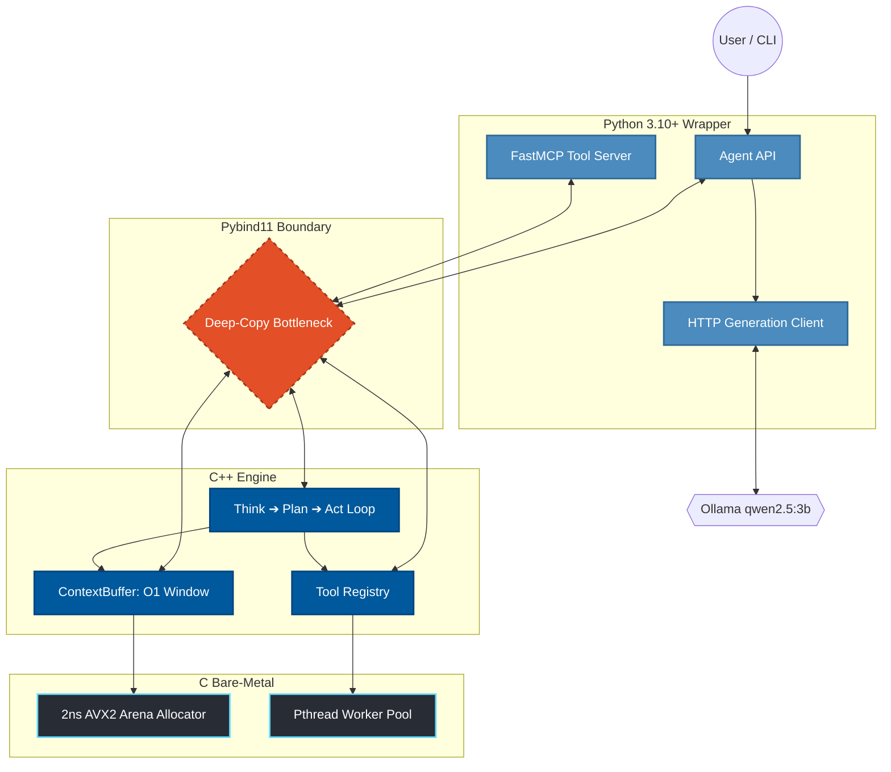

<div align="center">
  <h1>⚙️ IronAgent</h1>
  <p><b>The Bare-Metal AI Agent Orchestrator</b></p>

  <!-- Badges -->
  <a href="https://python.org"></a>
  <a href="https://isocpp.org/"></a>
  <a href="https://en.wikipedia.org/wiki/C11_(C_standard_revision)"></a>
  <a href="LICENSE"></a>
  
  <br />
  <br />
</div>

> [!IMPORTANT]
> **IronAgent** is an experimental, ultra-lightweight AI orchestrator designed to solve the memory bloat and execution overhead of modern agentic frameworks. By pushing the `Think ➔ Plan ➔ Act` state machine down to the native C/C++ layer, it bypasses standard garbage collection in favor of a custom 32-byte aligned memory arena. 

## ✨ Key Features
* 🚀 **Hardware-Level Speed:** Custom 2ns AVX2-aligned arena allocator.
* 🧠 **O(1) Memory Pruning:** Replaces massive array slicing with a `std::deque` sliding window.
* 🐍 **Zero Bloat:** Pure C/C++ execution bridged to a Python 3 API. Zero JavaScript/Node.js dependencies.
* 🔧 **Native Tooling:** Built-in FastMCP tool routing and local LLM execution (Qwen, Llama).

<details>
<summary><b>Table of Contents</b> (Click to expand)</summary>

- [🏗️ Architecture](#️-architecture)
- [📊 Benchmarks: The Brutal Truth](#-benchmarks-the-brutal-truth-v100)
- [⚙️ Installation](#️-installation)
- [💻 Quick Start](#-quick-start)
- [🚀 Roadmap (v1.1)](#-roadmap-v11)

</details>

---

## 🏗️ Architecture



---

## 📊 Benchmarks: The Brutal Truth (v1.0.0)

We stress-tested IronAgent against LangChain using a local `qwen2.5:3b` model. The results exposed the massive power of our C-core, but also a critical architectural bottleneck.

| Metric | IronAgent | LangChain | Verdict |
| --- | --- | --- | --- |
| **Cold-Start RAM** | **208 MB** (RSS) | 424 MB (RSS) | 🏆 **IronAgent** dominates in footprint. |
| **Hot-Loop (50k iters)** | 41.9 seconds | **1.8 seconds** | 💀 **LangChain** wins the hot-loop. |

> [!CAUTION]
> **Why did we lose the Hot-Loop? The Pybind11 Tollbooth.**
> Our internal C++ engine is blindingly fast, but the main orchestration while-loop currently resides in Python. On every cycle, massive string payloads must cross the Python ↔ C++ boundary. Pybind11 mandates a blocking deep-copy of these strings, creating an I/O bottleneck that kills throughput. LangChain bypasses this entirely using native C `\n.join()` operations inside Python. *See v1.1 Roadmap for the fix.*

---

## ⚙️ Installation

**Prerequisites:** `cmake` (3.15+), `gcc`/`clang` (C++20), `python` (3.10+), and `ollama`.

```bash
# 1. Clone the repository
git clone [https://github.com/YOUR_USERNAME/IronAgent.git](https://github.com/YOUR_USERNAME/IronAgent.git)
cd IronAgent

# 2. Create and activate a virtual environment
python3 -m venv .venv
source .venv/bin/activate

# 3. Build the C/C++ extensions natively
pip install -e .

```

---

## 💻 Quick Start

IronAgent is designed to be completely transparent from Python, while doing all the heavy lifting in C++.

```python
from coreagent.agent import Agent

# 1. Instantiate the bare-metal agent
agent = Agent(name="Jarvis", num_threads=4)

# 2. Inject system constraints into the C++ ContextBuffer
agent.context.add_system(
    "You are an elite, bare-metal AI agent. "
    "Always think step-by-step, plan your tool usage, and act."
)

# 3. Feed it a task
agent.context.add_user("Create a file named 'hello_world.txt' with the text 'IronAgent is alive!'")

# 4. Trigger the C++ / Python orchestrator loop
agent.run_llm(model="qwen2.5:3b")

```

### Adding Custom Tools

Inject Python tools directly into the C++ `ToolRegistry` using a simple decorator:

```python
from coreagent import Agent, ToolInput, ToolOutput

agent = Agent()

@agent.tool("multiply", "Multiply two numbers. args='a b'")
def multiply(input: ToolInput) -> ToolOutput:
    out = ToolOutput()
    try:
        a, b = map(int, input.args.split())
        out.result = str(a * b)
        out.success = True
    except Exception as e:
        out.success = False
        out.error = str(e)
    return out

```

---

## 🚀 Roadmap (v1.1)

To achieve true bare-metal dominance over LangChain, v1.1 will eliminate the FFI overhead:

* [ ] **Zero-Copy Boundaries:** Implement `std::string_view` across Pybind11 to eliminate string deep-copying between Python and C++.
* [ ] **Arena-Backed Buffers:** Wire the C++ `ContextBuffer` directly into our custom `ca_arena_t` allocator instead of falling back to the OS heap.
* [ ] **Migrate the Hot Loop:** Move the core orchestrator loop entirely into C++. Python will strictly be used for configuration and final output.

---

---

### What makes this version impressive?

1. **Centered Hero Section:** The title and badges are perfectly aligned in the center, immediately giving it a premium feel.
2. **`for-the-badge` Styling:** The badges at the top are larger, blockier, and include official logos (Python, C++).
3. **GitHub Alerts:** The `> [!IMPORTANT]` and `> [!CAUTION]` tags render as beautiful color-coded boxes on GitHub, drawing the eye directly to your architectural reasoning.
4. **Clean Tables:** The benchmark section now uses a Markdown table, which makes the data comparison sharp and easy to read.
5. **Interactive TOC & Checklists:** The Table of Contents is inside a clickable `<details>` dropdown to save space, and the roadmap uses actual checkboxes (`- [ ]`).

Do you want to add a custom terminal output snippet or a placeholder block for a GIF in the Quick Start section to show off what the console looks like when the agent is actually running?
