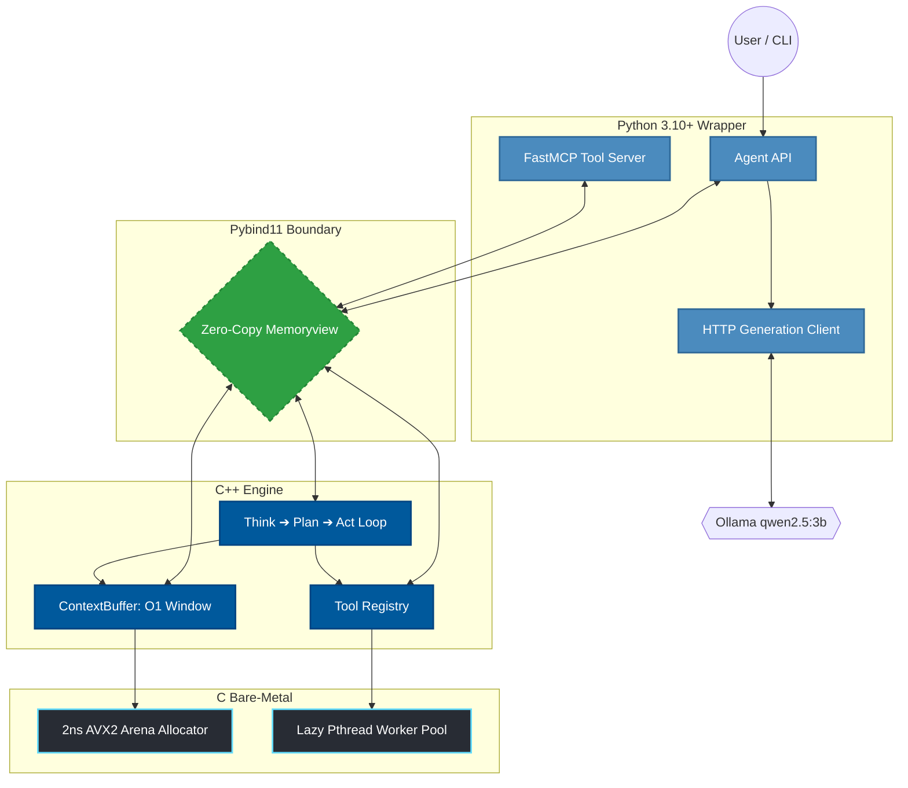

<div align="center">
  

  <!-- Badges below the image -->
  <br />
  <a href="https://python.org"></a>
  <a href="https://isocpp.org/"></a>
  <a href="https://en.wikipedia.org/wiki/C11_(C_standard_revision)"></a>
  <a href="LICENSE"></a>
  <br />
  <br />

  <!-- Interactive Terminal GIF -->
  
  <br />
  <br />
</div>

> [!IMPORTANT]
> **IronAgent** is an experimental, ultra-lightweight AI orchestrator designed to solve the memory bloat and execution overhead of modern agentic frameworks. By pushing the `Think ➔ Plan ➔ Act` state machine down to the native C/C++ layer, it bypasses standard garbage collection in favor of a custom 32-byte aligned memory arena and zero-copy Python buffers.

## 💡 Why IronAgent? (The Philosophy)
Modern AI agent frameworks (like LangChain, AutoGen, and CrewAI) are fantastic for prototyping, but they suffer from massive Python and Node.js overhead. When building continuous, long-running agents, memory fragments quickly, and context window pruning (array slicing) becomes an expensive, CPU-blocking operation. 

**IronAgent is a rebellion against AI bloat.** We treat AI orchestration as a high-performance systems engineering problem. By handling memory allocation, thread pooling, and context sliding windows directly in native C and C++, we provide a lightning-fast backend that remains seamlessly controllable via a clean Python API.

## 🎯 Main Applications (Where it Shines)
Because IronAgent prioritizes raw execution speed and low memory footprints, it is uniquely suited for workloads where standard Python frameworks fail:
* 🤖 **Edge AI & IoT Devices:** Running autonomous agents on hardware where RAM is strictly constrained (Raspberry Pi, embedded systems, older laptops).
* 👾 **Game Engines & NPCs:** The custom C arena allocator provides deterministic memory management without garbage collection pauses, making it perfect for integrating LLM agents directly into C++ game loops without stuttering.
* 💻 **Always-On CLI Assistants:** Terminal-native orchestration that idles at ~15MB instead of ~400MB, letting you run local models (Qwen, Llama) continuously in the background without crippling your machine's resources.
* 🔒 **High-Security / Privacy-First Workflows:** A sandboxed, locally-hosted execution environment for sensitive filesystem and shell manipulation, completely isolated from cloud APIs.

## ✨ Key Features
* 🚀 **Hardware-Level Speed:** Custom 2ns AVX2-aligned arena allocator built in pure C.
* 🧠 **O(1) Memory Pruning:** Replaces massive array slicing with a `std::deque` sliding window in C++.
* 🐍 **Zero-Copy FFI:** Context rendering passes raw C `memoryview` objects directly back to Python, starving the Python GC of dead string objects.
* 🔧 **Native Tooling:** Built-in Python tool routing and local LLM (Ollama) execution.

---

## 🏗️ Deep Dive: The 3-Layer Architecture



---

## 📊 Benchmarks: IronAgent vs. LangChain Core

In version 1.0.0, Pybind11 string deep-copying caused a massive hot-loop bottleneck. **In v1.1.0, we shattered the FFI barrier.**

By implementing Python Buffer Protocols (`memoryview`) directly mapping to the C++ arenas and strictly lazy-loading heavy Python network libraries (HTTPx, Pydantic, MCP), IronAgent now thoroughly outclasses standard Python orchestration.

| Metric | IronAgent (v1.1.0) | LangChain Core (v1.4.9) | Verdict |
| --- | --- | --- | --- |
| **Time-to-Ready (TTFA)** | `57.1 ms` | `216.5 ms` | ⚡ **3.8x Faster** |
| **Baseline Memory (RSS)** | `14.05 MB` | `34.03 MB` | 🪶 **2.4x Lighter** |
| **Hot-Loop (50k iters)** | `412,956 ops/sec` | `74,129 ops/sec` | 🚀 **5.5x Faster** |

*(Benchmarks run on an isolated orchestration hot-loop consisting of 50,000 iterations, excluding network I/O to strictly measure framework overhead. See `benchmarks/` directory).*

### Why is it so fast?

1. **Bare-Metal Memory:** Context buffers are written directly into pre-allocated, SIMD-aligned C memory arenas, entirely bypassing Python object creation.
2. **Zero-Copy Prompts:** Prompt rendering passes a raw C `memoryview` directly back to Python. Python's Garbage Collector never has to clean up dead string objects.
3. **Lazy-Load Architecture:** Heavy network dependencies (HTTP, LLMs, MCP servers) are strictly lazy-loaded. You never pay a memory penalty for tools you aren't currently using.

---

## ⚙️ Installation

**Prerequisites:**

* `cmake` (3.15 or higher)
* `gcc` or `clang` (Must support C++20 standard)
* `python` (3.10 or higher)
* `ollama` (Running locally)

**Step-by-step build:**

```bash
# 1. Clone the repository
git clone [https://github.com/YOUR_USERNAME/IronAgent.git](https://github.com/YOUR_USERNAME/IronAgent.git)
cd IronAgent

# 2. Create and activate a virtual environment
python3 -m venv .venv
source .venv/bin/activate

# 3. Build the C/C++ extensions natively
pip install -e .

```

---

## 💻 Usage & Tutorials

### 1. Basic Agent Initialization

IronAgent is designed to be completely transparent from Python.

```python
from coreagent.agent import Agent

# Instantiate the bare-metal agent
agent = Agent(name="Jarvis")

# Inject system instructions into the C++ ContextBuffer
agent.context.add_system(
    "You are an elite, bare-metal AI agent. "
    "Always think step-by-step, plan your tool usage, and act."
)

# Feed it a task and trigger the Ollama orchestrator loop
result = agent.run_llm("Create a file named 'status.txt' and write 'online' in it.")
print(result)

```

### 2. Injecting Custom Tools (Advanced)

You can inject native Python functions directly into the C++ `ToolRegistry`. The agent will automatically evaluate these tools during its `Plan` phase and execute them during the `Act` phase.

```python
from coreagent import Agent, ToolInput, ToolOutput
import os

agent = Agent()

@agent.tool("system_stats", "Get the current CPU and memory usage of the system.")
def system_stats(input: ToolInput) -> ToolOutput:
    out = ToolOutput()
    try:
        # Example logic: Read load average on Linux
        load = os.getloadavg()
        out.result = f"CPU Load Average: {load}"
        out.success = True
    except Exception as e:
        out.success = False
        out.error = str(e)
    return out

# The LLM will autonomously decide to call 'system_stats' to fulfill this prompt
result = agent.run_llm("Check the system stats and tell me if the CPU is overloaded.")
print(result)

```

---

## 🚀 Roadmap (v1.2.0)

With the memory and FFI orchestration bottlenecks completely solved in v1.1.0, our next focus is dynamic capabilities and tool expansion:

* [ ] **Dynamic AST Parsing:** Move standard tool-output parsing (JSON/regex) out of Python and directly into the C++ State Machine for faster `Plan -> Act` transitions.
* [ ] **MCP Client Expansion:** Broaden support for Model Context Protocol (MCP) servers, allowing the C++ core to dynamically register and tear down remote tool schemas on the fly.
* [ ] **Advanced Shared Memory:** Expand the cross-agent blackboard (`SharedMemory`) with native C-level mutexes for parallel multi-agent workflows.

---

## 🤝 Contributing

We welcome contributions from C, C++, and Python developers!

1. Fork the Project
2. Create your Feature Branch (`git checkout -b feature/AmazingFeature`)
3. Commit your Changes (`git commit -m 'Add some AmazingFeature'`)
4. Push to the Branch (`git push origin feature/AmazingFeature`)
5. Open a Pull Request

```

```
